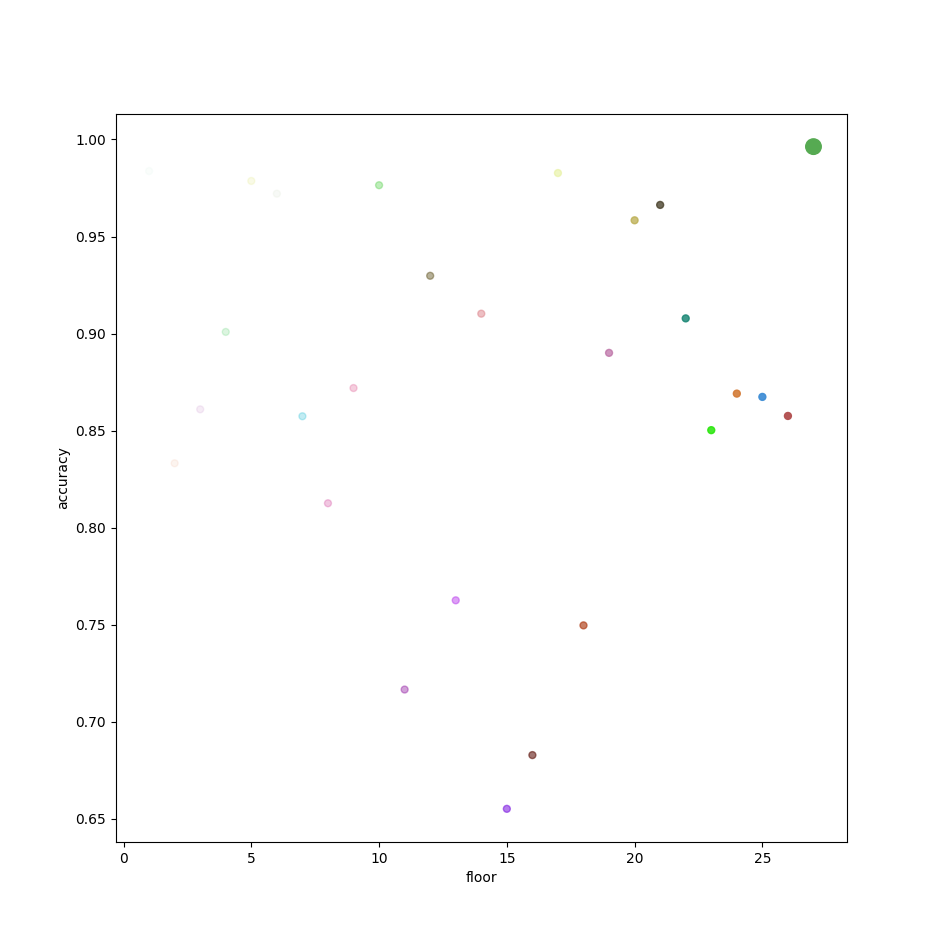
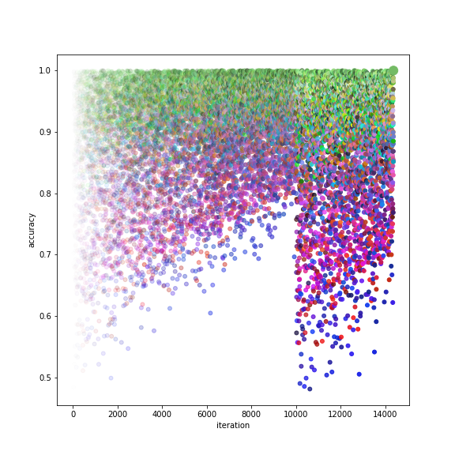

# Stochastic-RGB

A small experiment in derivative-free optimization based on progressively shrinking the search space around promising solutions.
The project explores whether a simple adaptive random search heuristic can efficiently converge without gradients, backpropagation, or evolutionary populations.

---

## Algorithm
At every iteration the optimizer:

1. Samples a candidate uniformly inside the current search region.
2. Evaluates the candidate.
3. Accepts it if **MSE (Mean Squared Error)** decreases and **cosine similarity** improves; climbs the "floor".
4. Identifies the coordinate contributing the largest error when the candidate is rejected and shrinks the sampling interval along that coordinate.
5. Resets the search region after excessive unsuccessful attempts (via patience counter).

The implementation is intentionally simple and serves as an exploration of an optimization heuristic rather than a production optimizer.

---

```text
initialize search region = [0, 1]^n

while not converged:

    sample candidate uniformly

    if candidate improves objective:
        accept candidate
        reset search region
        advance floor

    else:
        identify worst-performing dimension
        shrink search interval for that dimension

    if patience exceeded:
        restore full search region
```

---

## Example

The current implementation optimizes a normalized RGB vector toward

```python
target = [116, 186, 102] # green-ish
# with lr=0.0001 that also defines patience threshold at 1/lr iterations
```

using two acceptance criteria:

- Mean Squared Error
- Cosine Similarity

The optimizer terminates once the reconstruction error falls below the configured learning rate.

---

## Visualization

### Plot

Every sampled candidate is plotted via scatter in **matplotlib**.

- **X-axis:** optimization step ("floor")
- **Y-axis:** cosine similarity
- **RGB channels:** sampled RGB value
- **Alpha channel:** iteration order

---

### Media

Following images display the difference in sample distribution, depending on **LR (learning rate)** 

| High LR | Low LR |
|---------|--------|
|  |  |
| **High LR** (0.01) gives less representative plot and less precise verdict in exchange for speed | **Low LR** (0.0001) gives smoother plot and more precise verdict, featuring saw-like drops from patience resets |

---

## Properties

| Property | Value |
|----------|:-----:|
| Gradient-free | Yes |
| Backpropagation | No |
| Population-based | No |
| Adaptive search space | Yes |
| Black-box objective support | Yes |
| Requires differentiability | No |

---

## Reasoning

This was created to investigate whether a very small adaptive random search algorithm could achieve reasonable convergence using only local sampling heuristics.

The project is primarily intended as an optimization experiment and visualization rather than a replacement for established optimization methods.

---

## Limitations

The algorithm has not been formally analyzed and currently lacks comparisons against existing optimization techniques.

Future work includes:

- nothing (probably)

---

## Repository structure

```text
.
├── main.py
├── LICENSE
├── assets
│   ├── low_lr.png
│   └── high_lr.png
└── README.md
```

---

## License

Apache 2.0 (lulz)
